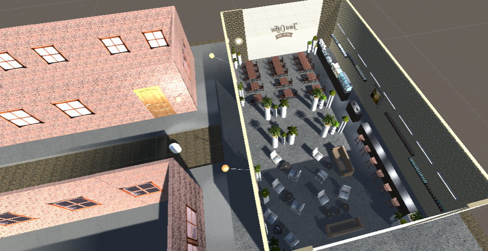

# UnityCoffeShop 2

Unity project.

The project is an upgraded version of UnityCoffeShop(located in the MASTER branch). 
In this version a second floor was added, along with stairs, decoration of the second floor, 2 NPCs that are the waiters in the coffe shop, each one showing a bunch of animations. 
It contains also sounds of: footsteps, opening/closing doors, sliding doors, drawers and a cover glass cake.

